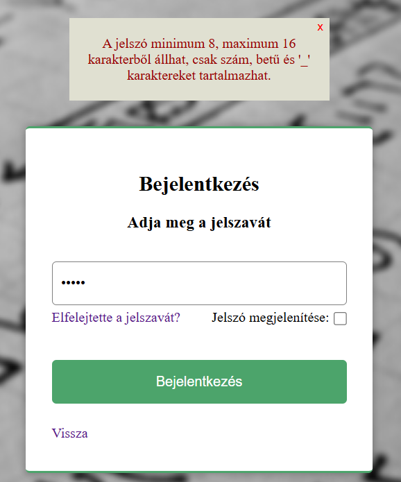
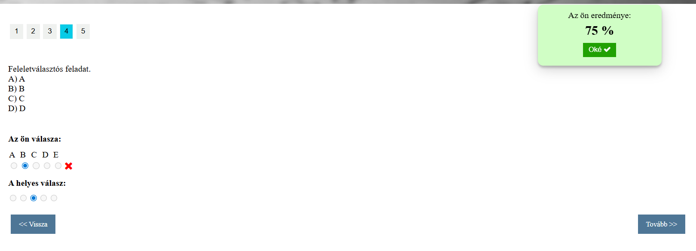
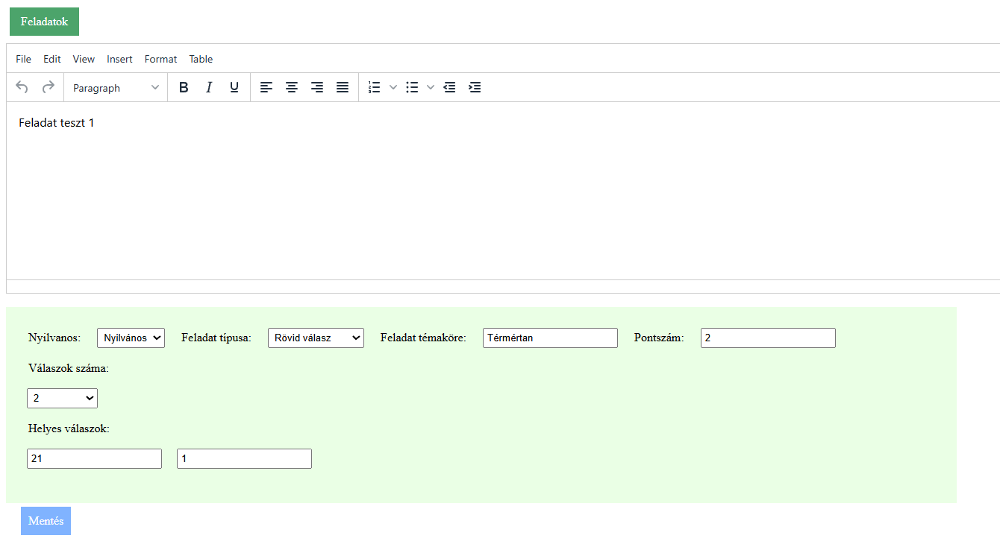

# Task Solving Web Application (Thesis Project)

A full-stack web application developed as a university thesis project. The system allows users to create and solve task sets, receive scores, and track their results.

---

## Features

- User authentication (login / registration)
- Session-based login system
- Role-based access system (Student, Teacher, Guest)
- Task solving interface
- Task uploading interface
- Group and task sequence interface
- Automatic score calculation
- Result tracking and history
- Database-driven content

---

## Technologies Used

- HTML
- CSS
- JavaScript
- PHP
- MySQL (XAMPP localhost environment)

### External Libraries
- PHPMailer (email functionality)
- TinyMCE – used for rich text task input

---

## Project Structure

The project follows a simple PHP-based architecture:

- PHP handles backend logic and server-side rendering
- HTML is embedded within PHP files
- CSS and JavaScript are separated into dedicated files
- External libraries are integrated where needed

---

## Screenshots

### Login Page

### Task Solving Interface after completion

### Task Uploading Interface for teachers

---

## Database Setup

The application uses a local MySQL database running on XAMPP (localhost only).

A SQL dump file is included in the repository:

### Setup steps:
1. Start XAMPP (Apache + MySQL)
2. Open phpMyAdmin
3. Create a new database under name `szakdolgzat_wiqpm2` or change the database name in includes/overall/db_connect.php file
4. Import the provided `szakdolgzat_wiqpm2.sql` file

---

## Running the Project

### Requirements:
- XAMPP (Apache + MySQL)
- PHP support enabled

### Steps:
1. Clone the repository
2. Place the project folder inside `htdocs`
3. Start Apache and MySQL in XAMPP
4. Import and Configure the database
5. Open the application in browser: http://localhost/your-project-folder

---

## Thesis

This project was created as part of a university thesis submission.

See included file:
`wiqpm2.pdf`

---

## Author

Kovács Krisztián
